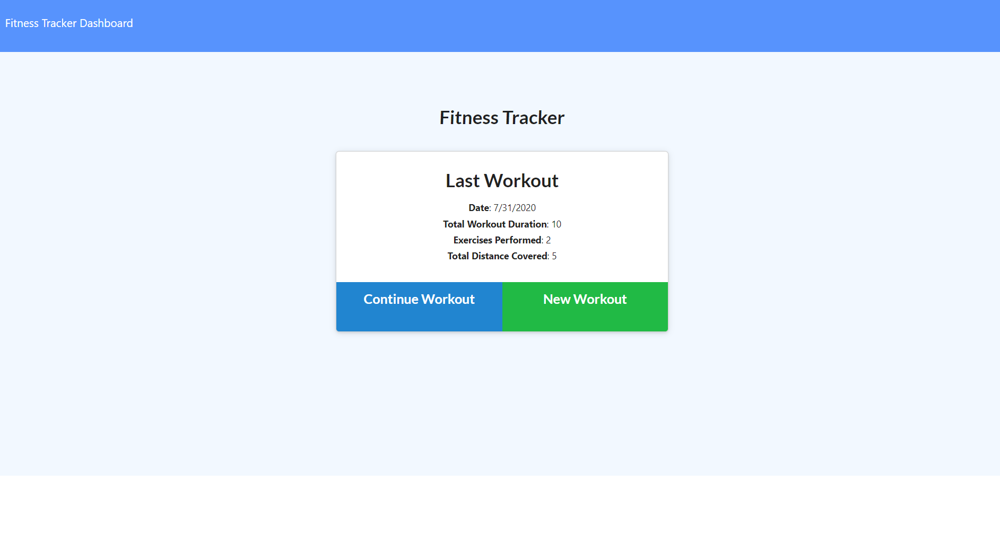
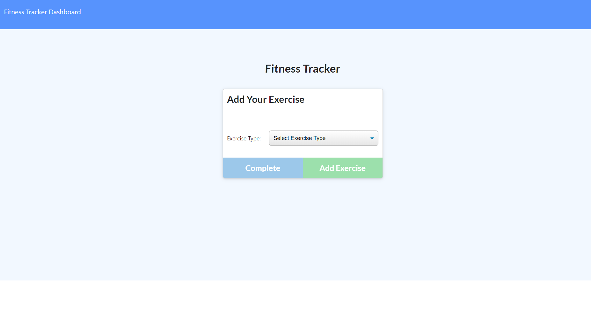
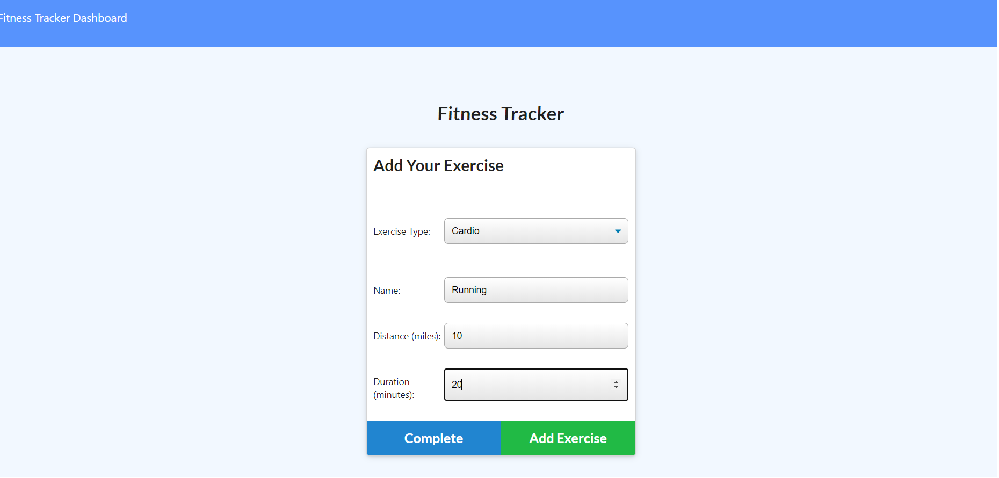
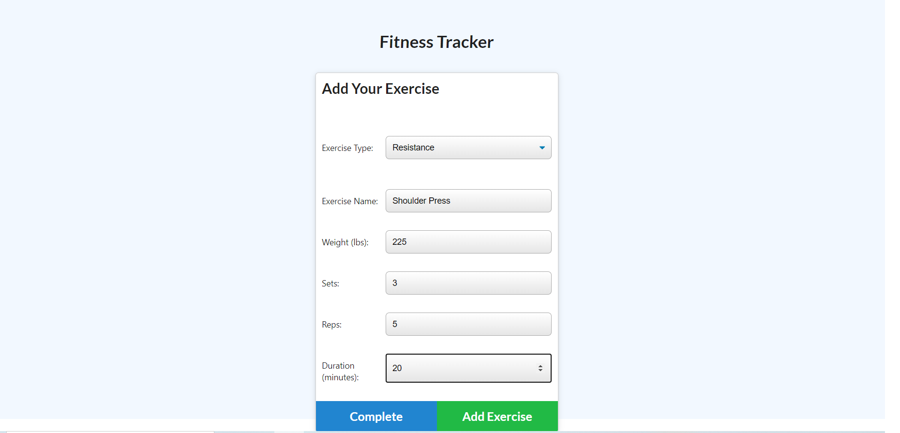

# [Fitness-Tracker](https://adam-fitness-tracker.herokuapp.com/)

## Description

Fitness Tracker is a full-stack application that allows the user to track and visualize their fitness progress. The user may add to or view their latest workout, or start a new workout where they can enter information about the exercises they completed. Fitness tracker provides the user with a series of charts to view their fitness progress by day, by duration of each exercise, and by pounds lifted. This helps the user visualize their fitness progress, track their successes, and identify areas for improvement.

## Table of Contents

- [Technologies](#technologies)
- [Usage](#usage)
- [Finished Product](#finished-product)
- [Directions for Future Development](#Directions-for-future-Development)

## Technologies

- [HTML](https://html.com/)
- [CSS](https://developer.mozilla.org/en-US/docs/Web/CSS)
- [JavaScript](https://www.javascript.com/)
- [Node.js](https://nodejs.org/en/)
- [Express.js](https://expressjs.com/)
- [MongoDB](https://www.mongodb.com/)
- [Mongo Atlas](https://www.mongodb.com/cloud/atlas)
- [Mongoose](https://www.npmjs.com/package/mongoose)
- [Chart.js](https://www.chartjs.org/)
- [Heroku](https://dashboard.heroku.com/apps)

## Usage

- Navigate to the [deployed Heroku App](https://adam-fitness-tracker.herokuapp.com/).
- On the home page the user is presented with their last workout. If they choose to contiue this workout they may click "Continue Workout" to add another exercise.
- If the user wants to begin a new workout press the "New Workout" button.
- Choose an exercise type: Cardio or Resistance.
- Enter relevant information about the exercise into input fields (name, miles, distance, weight, reps, etc.)
- Choose to complete the workout or add another exercise.
- Once workout is complete the user selects "Complete". Then they are taken back to the home screen where they can view their last workout information.
- User may navigate to the dashboard page to view charts representing their workout progress. Categories include duration of workout by day, duration by exercise type, weight lifted by exercise, and weight lifted by day.

## Finished Product

View deployed Heroku app [here](https://github.com/Adambear1/Workout_Tracker).  

## Directions for Future Development

In the future I think this application would be more useful to the user if they were able to view all of their past workouts, instead of just the last one. I would want them to be able to view a calendar and click on a specific day and view their workout information for that day. I would also like them to be able to make updates to past workouts, by adding and deleting exercises from a specified workout to better implement CRUD.
